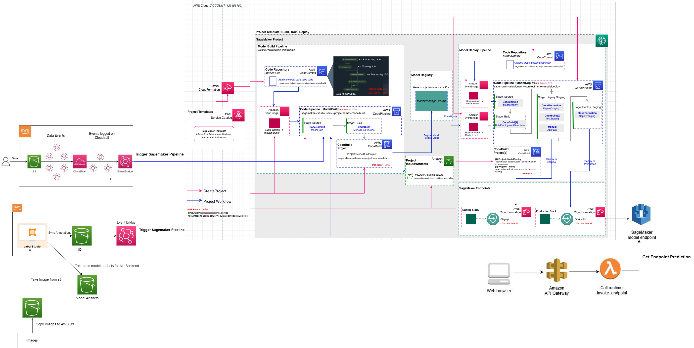

# MlOps 
This repository consists of different concepts related to machine learning development. Some of the concerns relate to pipeline creation, model registration, and monitoring. How to create a CI/CD pipeline and integrate it with Sagemaker Pipeline for entire ML life cycle management. Here I show complete end-to-end management of the entire ML life cycle, from annotation to drift detection to auto-model registration and deployment.

I try my best documenting every tutorial straight forward, if you find any error email me at [sushantgautm@gmail.com](sushantgautm@gmail.com).

## Table of Contents
1. [MLOps-Hyperparameter-Tuning](./MLOps-Hyperparameter-Tuning)
2. [Model-Evaluation-And-Explanation](./Model-Evaluation-And-Explanation)
3. [Sagemaker-Pipeline](./Sagemaker-Pipeline)
4. [CI-CD-Pipeline](./CI-CD-Pipeline)
5. [Label-Studio-Ml-Backend ](./Label-Studio-Ml-Backend)
6. [Project Frontend](./Project-Frontend)

Dataset Used: [Intel Image Classification](https://www.kaggle.com/datasets/puneet6060/intel-image-classification)

**Complete end-to-end architecture**

**If you want to download this image, click [here](images/tsai_emlov2-project_file.drawio.png)**

### Video Demonstration
* Entire Project Workflow: [Video link](https://drive.google.com/file/d/1WgXm1qwrqGQpO4_H-PpOJL6WBsX4WhjP/view?usp=share_link)
* Label Studio Backend: [Video Link](https://drive.google.com/file/d/1F7l47-HPptjWa5H0E1oKo2iWEn0yKygf/view?usp=share_link)
* Model Inference Detection: [Video Link](https://drive.google.com/file/d/1Nxsgok8iIMe9uiuR2pLVxmmKrt-JsBnm/view?usp=share_link)
* Sagemaker Project Overview: [Video Link](https://drive.google.com/file/d/1XhCgBCeFZngyJ7t0YOMktdt_TtdmA-TK/view?usp=share_link)
